# 🚀 Stock Battle: 가상 주식 투자 시뮬레이션 게임

실시간 주가 데이터를 기반으로 한 턴제 가상 투자 게임입니다. 고빈도 데이터 업데이트 상황에서의 프론트엔드 성능 최적화와 안정적인 백엔드 데이터 처리에 집중하여 개발되었습니다.

## 🛠 Tech Stack
* **Frontend**: React, Redux Toolkit, Axios, Taliwind CSS
* **Backend**: FastAPI, SQLAlchemy, Alembic
* **Database**: MySQL

## 👤 Key Contribution (이기준)

### 1. 전역 상태 관리 및 렌더링 최적화 (Frontend)
* **Redux Toolkit 도입**: 기존 `useContext` 기반 구조에서 발생하던 불필요한 전체 리렌더링 문제를 해결하기 위해 Redux로 전환했습니다.
* **도메인별 Slice 설계**: 종목 리스트, 실시간 차트, 사용자 잔고 정보를 모듈화하여 필요한 컴포넌트만 반응하도록 최적화했습니다.

### 2. 백엔드 시스템 설계 및 데이터 안정성 확보 (Backend)
* **FastAPI 아키텍처**: 확장성 있는 백엔드 구축을 위해 FastAPI와 SQLAlchemy를 활용하여 RESTful API를 설계했습니다.
* **인증 및 세션 관리**: 보안 강화를 위해 로그아웃 시 세션 및 쿠키 삭제 로직을 전담하여 구현했습니다.

### 3. 프로젝트 표준화
* **Alembic 마이그레이션**: 데이터베이스 스키마 버전 관리를 표준화하여 팀 협업 생산성을 높였습니다.
* **문서화 주도**: 통합 README 작성 및 디렉토리 구조 표준화를 통해 효율적인 개발 환경을 조성했습니다.

## 📺 Key Features

### 1. 실시간 주식 트레이딩 대시보드
실시간으로 변동되는 주가 차트와 호가 정보를 확인하며 전략적인 투자가 가능합니다.
| 트레이딩 메인 화면 | 매수 확인 모달 |
|:---:|:---:|
| 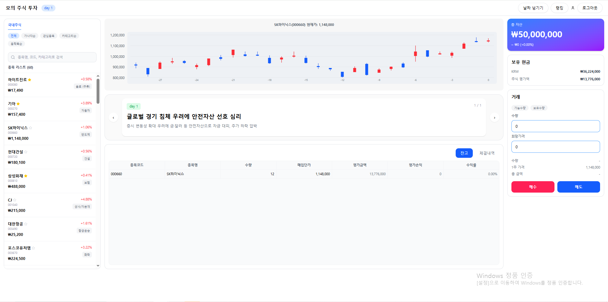 | 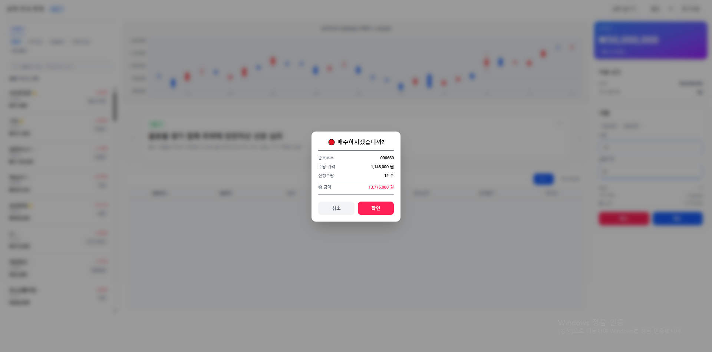 |
*   **종목 리스트**: 좌측 사이드바를 통해 다양한 종목의 등락률을 실시간으로 확인합니다.
*   **잔고 및 체결 내역**: 하단 탭을 통해 현재 보유 중인 주식 잔고와 상세 체결 내역을 모니터링할 수 있습니다. 주식 가격의 증감, 매수와 매도, 날짜 넘기기 등 이벤트가 일어나면 실시간으로 값이 바뀝니다.

### 2. 시장 뉴스 및 턴제 시스템
매일 도착하는 새로운 뉴스가 시장에 직접적인 영향을 미치며, 사용자는 이를 바탕으로 다음 날을 준비합니다.
| 새로운 뉴스 도착 | 뉴스 요약 인터페이스 |
|:---:|:---:|
| 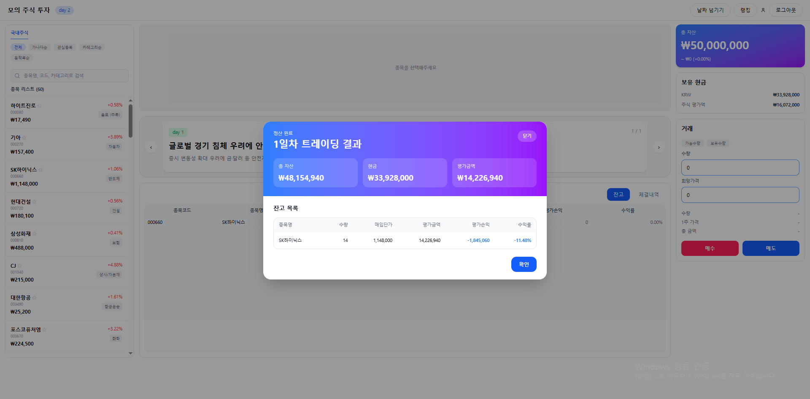 | 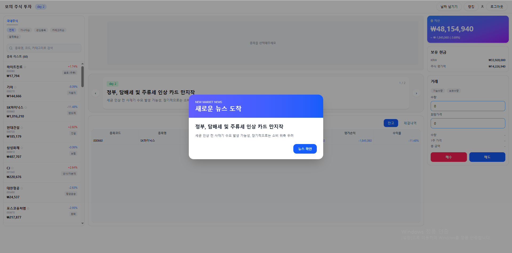 |
*   **날짜 넘기기**: 상단 '날짜 넘기기' 버튼을 통해 다음 날로 진행하며, 시장의 변화를 즉각적으로 체감합니다.

### 3. 정밀한 자산 정산 및 결과 보고
내 잔고 목록 뿐만 아니라 체결 내역 또한 볼 수 있습니다.
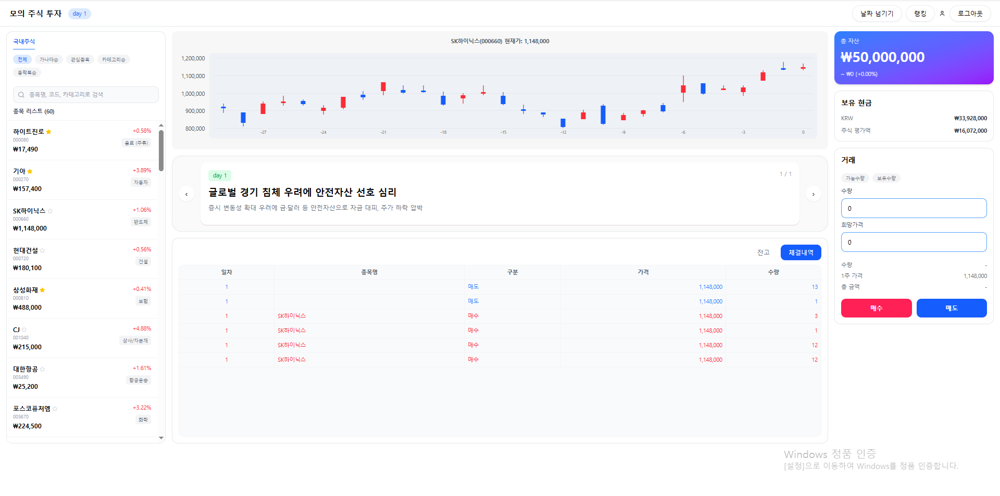
*   **체결 내역**: 체결 당 일차, 종목명, 매수 매도 여부, 가격 , 수량을 보여줍니다. 

### 4. 사용자 분석 및 랭킹 시스템
자신의 투자 성향을 분석하고 전체 참여자 중 나의 위치를 파악할 수 있습니다.
| 마이페이지 (자산 구성 및 통계) | 실시간 유저 랭킹 |
|:---:|:---:|
| 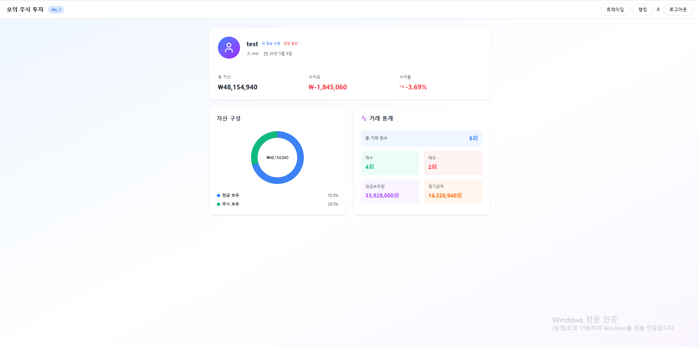 | 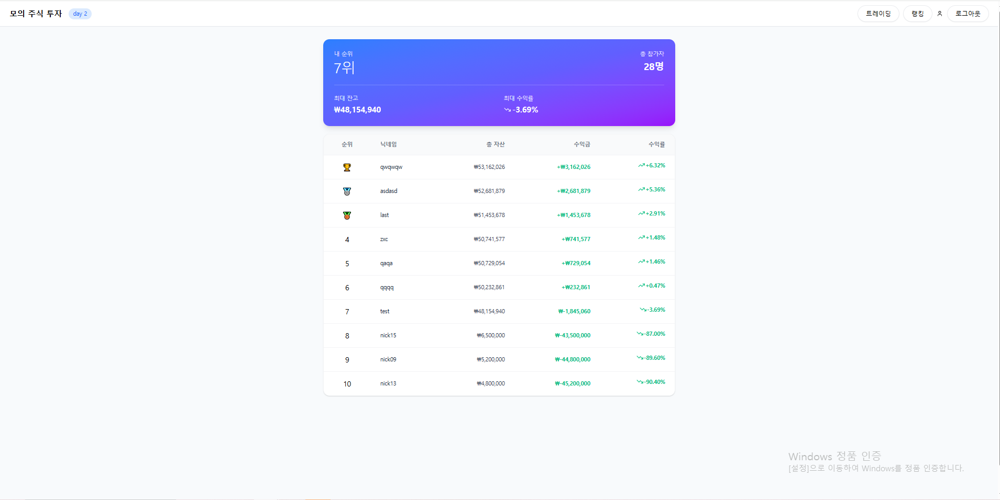 |
*   **포트폴리오 분석**: 내 정보 페이지에서 현금과 주식 비중, 총 거래 횟수(매수/매도) 등 상세한 투자 데이터를 보여줍니다.
*   **경쟁 시스템**: 수익률과 총 자산을 기준으로 유저 간의 실시간 순위를 제공합니다.


## 🚀 Troubleshooting

### 비동기 레이스 컨디션(Race Condition) 방지 및 데이터 무결성 확보
* **문제 상황**: 턴제 시스템의 '날짜 넘기기' 과정에서 데이터 불일치 현상이 발생했습니다. 뉴스 모달에서 모든 필요한 API를 병렬로 호출하다 보니, 특정 API 응답이 지연된 상태에서 다음 턴으로 진입하여 데이터 무결성이 깨지는 오류가 발생했습니다.
* **해결 방안**: 뉴스 모달을 단순 정보 전달 창이 아닌 **'데이터 로딩 버퍼'**로 재설계했습니다. 데이터 요청 시점을 한 단계 앞선 **정산 모달**로 변경하여 미리 API를 호출하고, 사용자가 뉴스를 확인하는 시간을 데이터 수신 대기 시간으로 활용했습니다.
* **결과**: 인위적인 로딩창 대신 게임 콘텐츠를 활용해 **매끄러운 사용자 경험(UX)**을 유지하면서 데이터 무결성 오류를 완벽히 해결했습니다.

## 📊 Database Schema (ERD)
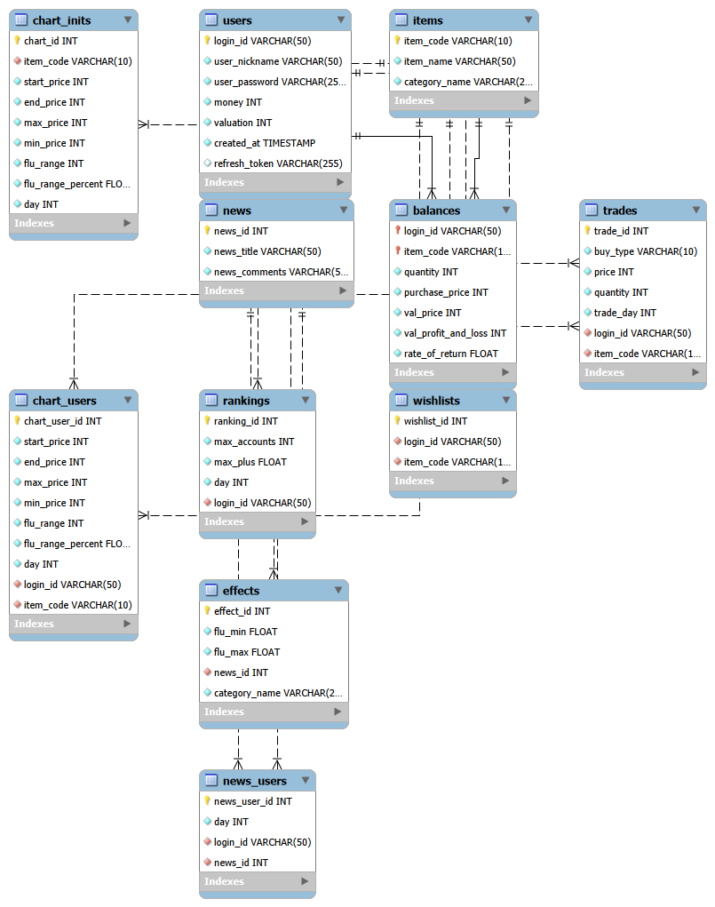

## 🔌 API Specification
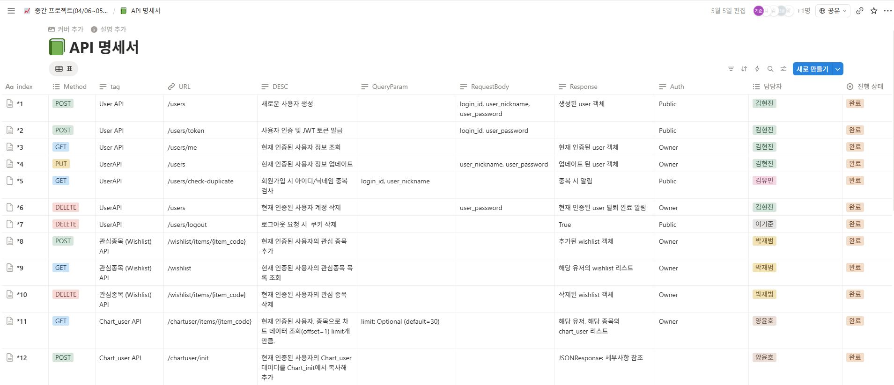
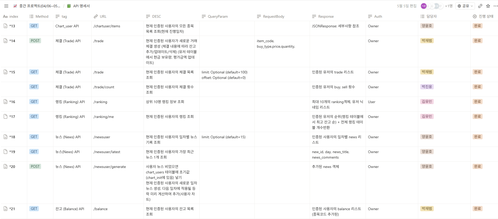
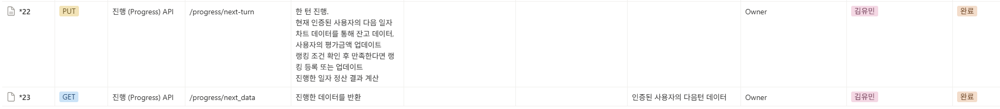

## 📂 Directory Structure

```bash
.
├── backend                 # FastAPI 기반 백엔드 서버
│   ├── alembic/            # 데이터베이스 마이그레이션 관리 (Alembic)
│   ├── app/
│   │   ├── api/            # API 엔드포인트 라우터 (User, Stock, Trade 등)
│   │   ├── core/           # 설정 및 보안 (JWT, Config)
│   │   ├── crud/           # DB 생성/읽기/수정/삭제 로직
│   │   ├── models/         # SQLAlchemy DB 모델 정의
│   │   └── schemas/        # Pydantic 데이터 검증 스키마
│   ├── main.py             # 백엔드 애플리케이션 진입점
│   └── alembic.ini         # 마이그레이션 설정 파일
│
├── frontend                # React 기반 프론트엔드
│   ├── public/             # 정적 자원 (index.html, favicon 등)
│   ├── src/
│   │   ├── components/     # 재사용 가능한 UI 컴포넌트
│   │   ├── pages/          # 각 화면별 페이지 컴포넌트
│   │   ├── store/          # Redux Toolkit Slices 및 전역 상태 관리
│   │   ├── styles/         # Styled-components 및 글로벌 스타일
│   │   └── App.js          # 프론트엔드 메인 라우팅 및 진입점
│   └── package.json        # 프론트엔드 의존성 관리
│
├── images/                 # README용 프로젝트 이미지
├── .gitignore              # Git 제외 파일 설정
└── README.md               # 프로젝트 공식 문서
```

## 👥 Contributors
본 프로젝트는 총 6명의 팀원과 함께 협업하여 완성되었습니다.
* **이기준 (Me)**: 프론트엔드 상태 관리 최적화 및 백엔드 핵심 로직 개발
* **박재범**: 관심종목 및 체결(Trade) 시스템 API 담당
* **양윤호**: 차트 데이터 및 뉴스 시스템 API 담당
* **김현진**: 사용자(User) 인증 및 정보 관리 API 담당
* **김유민**: 랭킹 시스템 및 게임 진행(Progress) 로직 담당
* **박진웅**: 거래 횟수 조회 등 데이터 통계 API 담당
